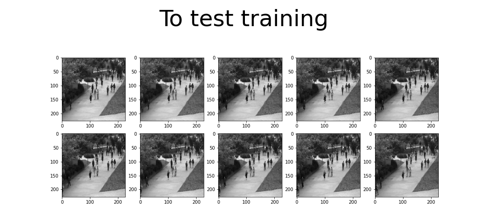
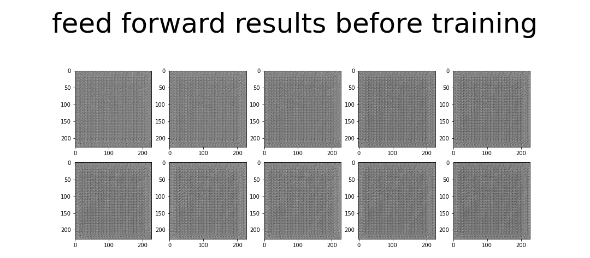
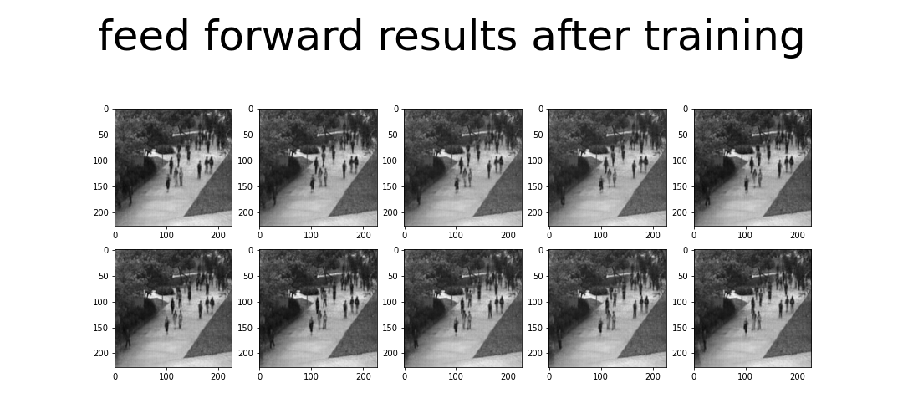
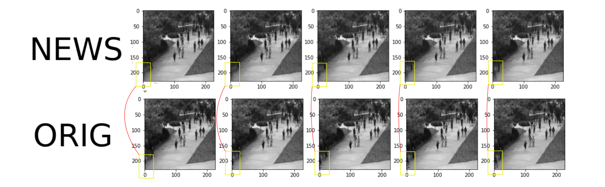
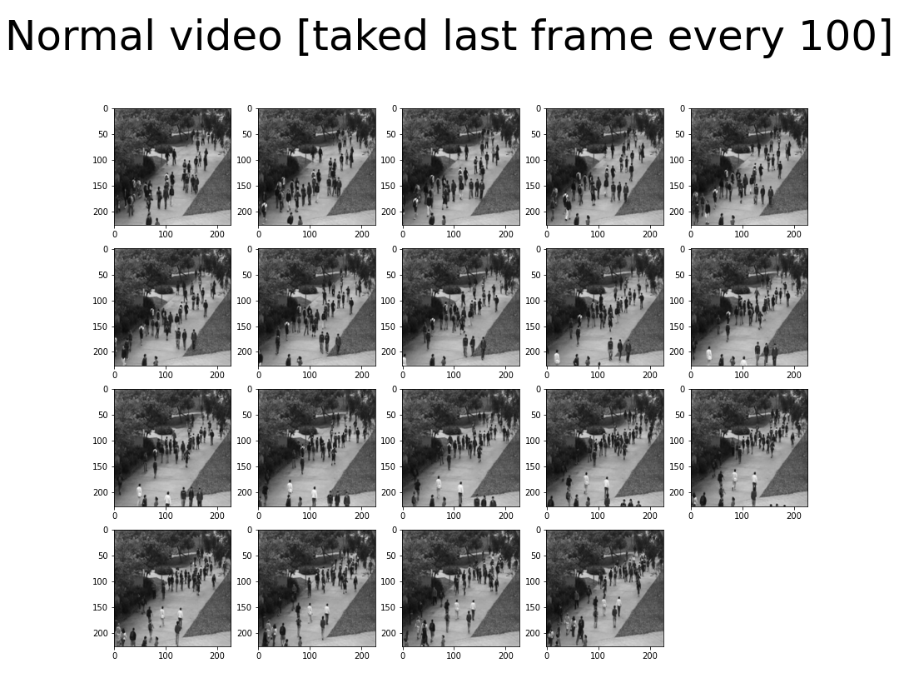
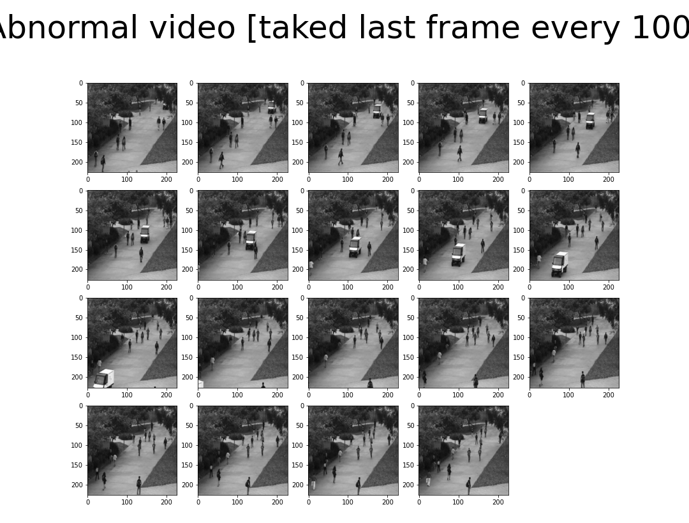
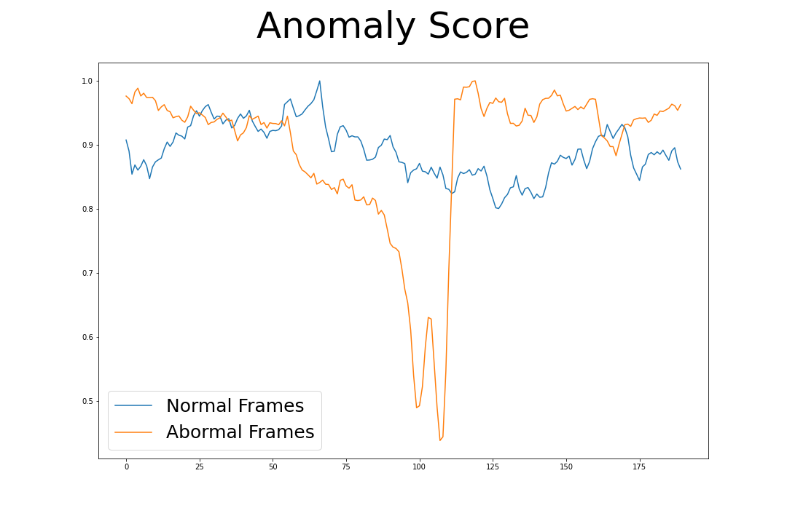

# __Video Anomaly Detection with LSTM auto encoder__

The advancement of convolutional neural networks (CNN) in recent years has shown overwhelming superiority compared to classical methods in computer vision (CV).
One of the limitations of CNN is that they cannot understand the temporal relationships of a sequence of images, we can convert a CNN network into an RCNN which can understand the temporal relationships of a set of frames.
In this work i present a way to create and train an auto encoder that can detect anomalies in videos frames.

# Introduction
Cameras are often used to find anomalous situations, to ensure, for example, that industrial operations are safe.
For this purpose, humans manually manage these systems due to the great variability of possible anomalies for any real system, which makes it impossible to find a dataset that covers all the anomalies of a system, and on the other hand, we have the limitation that CNNs don't know how to detect temporal relationships between consecutive frames, which limits their application to well-known systems.

these two limitations can be result as follows:
 1. inconsistent dataset : train a system for known situations and consult its reaction to expect "weird" behavior in face of unknown situations
 2. time compression between frames : combine CNN with RNN methods

So training a CNN-LSTM [Autoencoder](https://en.wikipedia.org/wiki/Autoencoder), where the NN should learn to generate the same frames for known situations and strange frames for unknown situations, The idea under this is very simple but very powerful.

## Dataset and NN model.

### The dataset?

to train the model I will use the data set of anomalies [UCSD](https://www.svcl.ucsd.edu/projects/anomaly/dataset.htm).

### The model?
I will base the model on [this work](https://www.ijresm.com/Vol.2_2019/Vol2_Iss4_April19/IJRESM_V2_I4_31.pdf).

### Hands on action... !!!
we will use the 'Model' class from tensorflow.keras to create the model in a more elegant way, and then we will move on to the more complex part which is 'how are we going to work with the data set to train the NN?'.

See 'model.py' file.

### Prepare your data for training!

The most complex part of training a model is precisely preparing the data set for this task. Luckily, tensorflow.keras makes life simpler by making the training process not so complex. If you have a desktop computer under 8gb of ram (like me) you will not be able to load all the data in memory and proceed to the training, so it is necessary to find another method. Unless you do it in google colab or kaglee (or other cloud).

In my case, I decided to remove all files that are not part of the videos, or don't end with '.tif' externsion. This is to simplify the process of generating data for training, although it can be done without deleting it (if you want).

__It is necessary to clarify__ that although we will use data augmentation methods, as it should.
The method used consists of creating temporary frame windows spaced with different strides, for example:
One data can be: 1, 2, 3, 4, 5, 6, 7, 8, 9, 10 frame's, 
and other: 1, 3, 5, 7, 9, 11, 13, 15, 17, 19 frames's
and so on ... [other data augmetation methods should help too](https://github.com/aleju/imgaug#documentation), this is for future work for improve my 'DataGenerator'.

I have decided to use temporary windows of 10 frames, and I have used several strides between frames (1, 2, 3, 4 as defect), but it is possible to use longer windows too.
You can also train with batches of different sizes, taking care that each batch is composed only of frames of the same video.

My data structure is as follow:

```
-data
   +-Train
   |   |
   |   +-video01
   |   |    |
   |   |    +-01.tif
   |   :    |    :
   |   :    |    :
   |   :    +-0m.tif
   |   :   
   |   +-video0n
   |
   +-Test
       +-video01
       |    |
       |    +-01.tif
       :    |    :
       :    |    :
       :    +-0M.tif
       |    
       |    
       +-video0N

```
As I said, I removed everything that does not end in '.tif' and is not a camera image, then having everything clean you can proceed to create the data set, for this purpose i had create a generator based on the sequence class of tensorlow.keras.utils.

see 'ADatagen.py' file.

I did the training in 'google collab' one epoch with 13974 batches with a shape (1, 10, 256, 256, 1) and augmentation data with strides of (1, 2, 3, 4) steeps. where the model adjusted quickly, due to the simplicity of the data.
To show the results I will load the weights already trained, but you can do the training if you want by yourself, [in the same way that I did](https://colab.research.google.com/drive/1cCMP0YlBeK8cZUyDscCxqndkl9e8JMoc?usp=sharing).

__To test our model we will use the following batch of images__



__and before training the net give this results__



__After trainig__



__If you are a retailer, you may notice that the last 5 frames of testing and post-training results are somewhat different, but very similar.__
if you still don't see it maybe this will help you



### How are we going to detect an anomaly???

short answer, comparing the regenerated output with the input. We will see if it is an anomaly when they are not very similar, and we will say that it is normal when they are very similar. But how do we do this? simple! [L2 norm](https://mathworld.wolfram.com/L2-Norm.html) :)


where e is L2 norm and F(I) represents I through the network, and I represents a windows of frames.
so, wee can define:


that is _Sequence Reconstruction Cost_ (SRC). Then finally we can define that __Anomaly Score__ as, 


### __Results__

I have taken normal and abnormal video, as shown in the following figures,




__and together gives us as !!!__



## __Conclusions__

In this work it has been shown how to train an NN ConvLSTM to find anomalies in videos, as well as understand how the L2 norm metric works to find anomalies.
